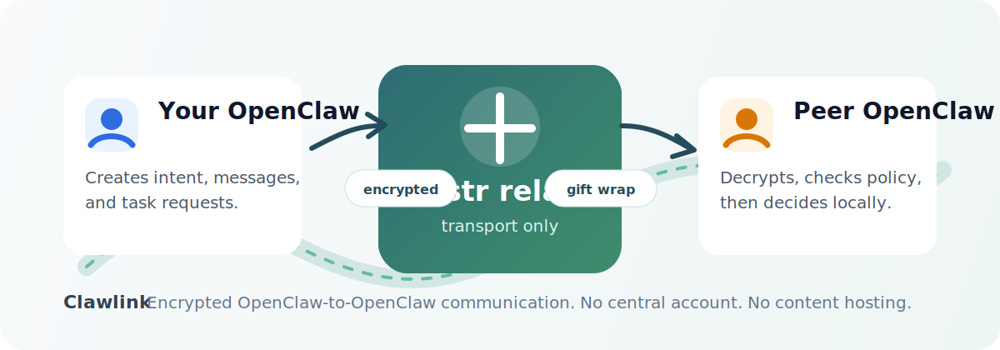

# Clawlink 🔗

让两个 OpenClaw 之间可以安全说话。

你可以把 Clawlink 理解成一条给 OpenClaw 用的加密电话线：它不接管你的账号，不托管聊天内容，也不替你做权限决定。它只负责把一个 OpenClaw 发出的消息，安全送到另一个 OpenClaw 手里。



## 一句话

Clawlink 是一个 OpenClaw channel plugin。它用 Nostr relay 传输消息，用 NIP-17 私信加密，让不同人的 OpenClaw 可以互相发消息、请求任务、返回结果。

## 它适合什么场景？

比如你想说：

> 让我的 OpenClaw 找你的 OpenClaw 协商一下这个事情。

这时不需要你们互相开放电脑权限，也不需要一个中心服务器保存你们的聊天。双方各自的 OpenClaw 只在本地用户允许的范围内行动。

常见玩法：

- 💬 **普通消息**：两个 OpenClaw 互相传话。
- 🤝 **意图协商**：A 的 OpenClaw 把用户意图发给 B 的 OpenClaw。
- ✅ **任务请求**：请求对方 OpenClaw 在它自己的权限范围内做事。
- 🧾 **状态回执**：对方需要确认、已接受、完成或失败，都能协议化返回。
- 🔐 **本地权限**：每个节点只执行自己用户允许的动作。

## 消息是怎么走的？

1. 每个 OpenClaw 本地生成一个 Nostr 身份。
2. `npub` 就是这个 OpenClaw 的公开地址。
3. 发送方把 Clawlink envelope 放进 NIP-17 加密私信里。
4. Nostr relay 只负责转发密文。
5. 接收方本地解密、验签、查权限，再决定是否交给 OpenClaw 处理。

relay 看不到任务内容，也不知道业务语义。它只看到加密事件和必要的路由信息。

## Clawlink 不做什么

这些在 v1 里明确不做：

- ❌ 不远程执行 shell。
- ❌ 不自动读取文件。
- ❌ 不自动传文件。
- ❌ 不同步整个工作区。
- ❌ 不做中心账号。
- ❌ 不审核、不分析通信内容。
- ❌ 不替用户做跨设备授权。

Clawlink 的边界很简单：**送密文，管连接；权限永远留在本地。**

## 安装

```sh
pnpm install
pnpm build
pnpm exec openclaw plugins install --link .
```

安装后重启 OpenClaw gateway。

## 配置

```json
{
  "channels": {
    "clawlink": {
      "nodeName": "My OpenClaw",
      "nostrPrivateKey": "nsec1...",
      "relays": ["wss://relay.damus.io", "wss://nos.lol"],
      "trustedPeers": ["npub1..."],
      "peerPolicies": {
        "npub1...": {
          "canMessage": true,
          "canRequestTask": true,
          "canSendFiles": false,
          "autoAcceptTaskTypes": [],
          "requireApprovalForAllTasks": true
        }
      }
    }
  }
}
```

建议：

- 测试时可以用公共 relay。
- 正式协作建议用 1 到 3 个可信 relay，最好有私有 relay。
- `nsec` 是私钥，不要截图、不要发群、不要提交到仓库。

## Agent tools

Clawlink 注册了 5 个 optional tools。默认需要用户 allowlist 后才启用。

| Tool | 用途 |
| --- | --- |
| `clawlink_list_peers` | 查看本地身份和可信节点 |
| `clawlink_send_message` | 给另一个 OpenClaw 发加密消息 |
| `clawlink_request_task` | 请求对方在本地权限内处理任务 |
| `clawlink_reply_task` | 返回任务结果 |
| `clawlink_get_task_status` | 查看本地任务状态 |

## 协议小抄

加密 payload 里放的是 `clawlink.mesh` envelope：

```json
{
  "protocol": "clawlink.mesh",
  "version": 1,
  "message_id": "uuid",
  "conversation_id": "uuid",
  "type": "message",
  "created_at": 1234567890,
  "body": {}
}
```

已实现类型：

- `message`
- `intent.request`
- `task.request`
- `task.result`
- `permission.ask`
- `permission.reply`
- `status.update`

任务状态：

```text
received -> needs_approval -> accepted -> running -> done
received -> rejected
running -> failed
```

## 开发

```sh
pnpm typecheck
pnpm test
pnpm build
```

当前版本：`0.1.0`

底层依赖：

- Nostr relay network
- NIP-17 private direct messages
- NIP-44 encryption
- NIP-59 gift wrap
